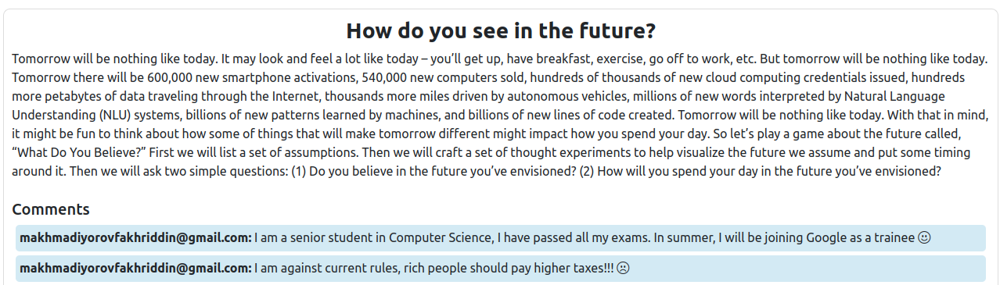

# 🤖 Ruby + AI Hacking Fest 🤖
## --> ❗️ fork this repo in order to participate in the hacking fest.

Welcome to the Ruby + AI Hacking Fest! This online hackathon is a weekend-long event starting on Friday night, May 17th, and concluding on Sunday afternoon, May 19th. The goal is to create a boilerplate Rails application using any existing, publicly available AI model. Participants will integrate the model into their Rails application via API, ensuring it runs seamlessly on a local machine.

# Rules and Guidelines
### Setup
It is sentiment analysis of the message. Comments belonging to the post can be **NEGATIVE**, **NEUTRAL** and **POSITIVE**. It is a microservice architecture, Flask is used for AI part (labelling) and Rails is for web. This app can be used to find out what opinions people have about the news or something new. This app can be very helpful in areas such as legislation, commersing, business.

**AI**
transformers library is used from HuggingFace, pipeline analyzes loaded text

### Python
1. Create a new virtual environment:
python3 -m venv venv
2. Activate the virtual environment:
source venv/bin/activate
3. Install Flask and transformers dependencies:
pip install flask transformers
pip3 install torch torchvision torchaudio --index-url https://download.pytorch.org/whl/cpu

### Ruby on Rails Setup

1. Run database migrations:
rails db:migrate 

2. Seed the database (if needed):
rails db:seed

### Running the application
1. Start the Flask server:
python3 app.py
2. Start the Ruby on Rails server:
rails s

